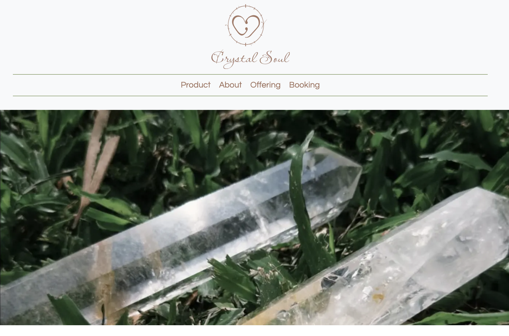

# Hi Welcome to my crystal shop

## 1.Overview


## 2. Installation

install npm
 ```npm install```

 and then run npm run dev
 ```npm run dev```

## 3.dependencies
This project depends on the following libraries and tools:
- React: A JavaScript library for building user interfaces.
### How to Install
Run the following command to install all dependencies:
```npm install```
### Installing Bootstrap
To include Bootstrap in your project, run the following command:
```npm install bootstrap ```
### Importing Bootstrap CSS
```import 'bootstrap/dist/css/bootstrap.min.css';```
```import 'bootstrap/dist/js/bootstrap.bundle.min.js';```

Before the closing <body> tag (JavaScript):

```<script src="path/to/bootstrap.bundle.min.js"></script>```

Then, import Bootstrap into your project:

```import 'bootstrap/dist/css/bootstrap.min.css';```
```import 'bootstrap/dist/js/bootstrap.bundle.min.js';```

 Create components file and start coding.

# Instructions:
The landing page is the homepage, which users can access by clicking the logo as well.
Click on the product page to switch to the crystal page.

